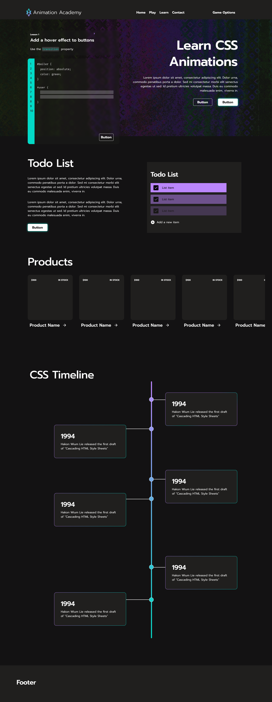

# Animation Academy

  
[Open Animation Academy >](https://jacobbenowitz.github.io/animation_academy/)  

## Contents

- [Background](#background)
- [Built With](#built-with)
- [Functionality](#Functionality)
- [Feature Highlights](#Feature-Highlights)
- [Wireframes](#Wireframes)
- [Features In Development](Features-In-Development)

___

## **Background**

Welcome to Animation Academy! Learn how to make a webpage interactive using the `transition` and `animation` CSS properties. By the time you get to level 10, you'll be able to write transitions, apply animations, and even write your own @keyframes animations!
<!-- Your goal is to make this webpage interactive, just follow the prompts to polish this site up! -->

CSS Animations make a web experiences engaging by selecting static HTML elements and changing their properties for a period of time. This can be in response to user actions, or an event such as a scroll or page load.

The game will start with `transitions`. The prompt provides instructions on the level objective as well as syntax hints. The advanced section, `animations`, will teach users how to animate elements with percentage states, `@keyframes`, and further polish animations by smoothing them out.
___
### **Built With**

This website was built without external API's or dependencies.

- Node.js
- HTML
- SCSS
- webpack
- Vanilla DOM manipulation

*In addition, this project will include:*

- a production README.md file
___
### **Functionality**

User's are able to:

- type CSS into a pseudo IDE
- once the level is completed successfully the CSS from that is applied to the DOM
- a temporary overlay will notify them of level success
- reset to level 0
- navigate forwards and backwards between levels

## Feature Highlights

### Dynamically Create & Update the Prompt & Ide
**Prompt:**

```javascript
updatePromptContent(currentLevel) {
    // lesson id
    const lessonId = document.querySelector('.lesson-id');
    lessonId.innerHTML = "Lesson: " + `${currentLevel.lessonNumber}`;
    // lesson title
    const title = document.querySelector('.prompt-title');
    title.innerHTML = `${currentLevel.promptTitle}`;
    // lesson instructions
    const instructions = document.querySelector('.prompt-instruction');
    instructions.innerHTML = `${currentLevel.promptInstructions}`;
    /// lesson hints
    const hintsList = document.querySelector('#prompt-hint-list');
    this.updateHints(hintsList, currentLevel);
  }
```

**Ide:**

```javascript
updateIdeContent(currentLevel) {
    // generate correct amount of line numbers
    this.updateLineNums(currentLevel);
    // update textarea for size of solution
    this.updateInput(currentLevel);
    // update boiler code before & after user input
    this.updateBoilerCode(currentLevel);
  }
```

### RegEx Solution Matcher

```javascript
    regexCheck(inputTextArr, solution) {
      const regexMatchers = [];
      // build regex array containing solutions
      for (let i = 0; i < solution.length; i++) {
        const regex = new RegExp(solution[i]);
        regexMatchers.push(regex);
      }
      let numMatches = 0;
      // match every input with regexMatchers
      for (let i = 0; i < inputTextArr.length; i++) {
        const input = inputTextArr[i];
        for (let j = 0; j < regexMatchers.length; j++) {
          const regex = regexMatchers[j];
          if (input.match(regex) !== null) {
            // increment numMatches if match found
            numMatches += 1;
          }
        }
      }
      // check if all solutions are matched
      if (numMatches >= solution.length) return true;
      return false; // if input not matched, it was wrong
    }
```

**On level success, level specific animations added to DOM and overlay event triggered**

```javascript
  levelAnimation() {
    // dynamically grab this level's animations to apply to DOM
    const animation =
      this.animationKey[this.currentLevel.lessonNumber]
    animation(); // invoke the animations
    // pull the correct success message for this level
    const successMessage = this.currentLevel.successMessage;
    // invoke the level success overlay with the message
    this.levelFunctionality.levelSuccessAnimation(successMessage)
    this.renderNextLevel() // render next level (update prompt & ide)
  }
```

___

## Wireframes

[CSS Animation Game Wireframe - Figma](https://www.figma.com/file/bje4NnMpHhoA5q3TrHcK4v/CSS-Animation-Game?node-id=0%3A1)



## **Implementation Timeline**

### **Thursday**

- Project scope, features, wireframes, tech stack

### **Fri - Sun**

- Solidify the levels for each section
- Design style, color themes
- List of all game assets needed
- Fonts
- HTML/CSS skeleton of all elements needed for MVP
- CSS Reset
- CSS grid system

### **Mon**

- Complete UI for base game
- Finalize all game assets
- Section #1: transforms

### **Tue**

- Game logic, event loops, and check user input logic
- Section #2: animations and keyframes

### **Wed**

- Refine instructions, prompts, and hints
- Bug testing and refactoring

### **Thu**

- Deployment to GitHub

___

## Features In Development

- Generating levels from a csv file, parsing in real time
- Checking user input on the fly using throttle/debounce (versus only on button click)
- Clearly notifying user if input is incorrect
- Additional levels covering
  - More basic transition levels to teach the fundamentals
  - Loading animations using multiple svgs
  - Placeholder animations on page load (before content is ready)
  - Advanced @keyframe animations
- Disable level navigation levels unless user has completed the level
- User hints if they are lost
  - use localStorage to save all levels completed, not just current level
- Products levels:
  - Reveal text via animation on hover
  - Scrollable interface with transitions
- CSS Timeline levels
  - animate in on scroll events
- Refine game for all screen types and inputs (mobile, tablet, laptop, desktop)
  
____