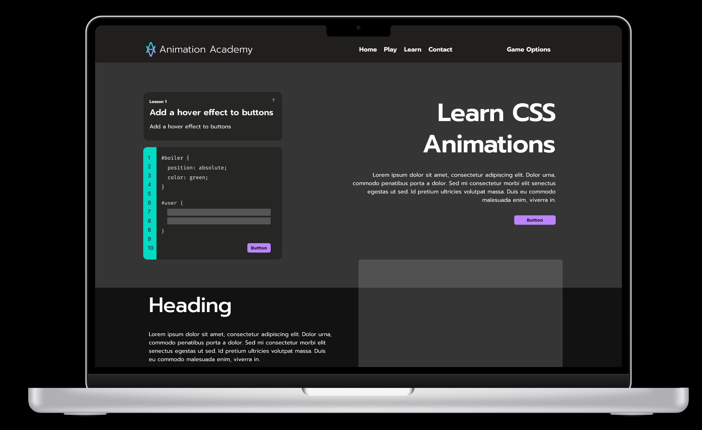

# CSS Animation Game
# **Background**

This CSS Animation Game will teach the user about basic and advanced CSS animations. CSS Animations make a web experiences engaging by selecting static HTML elements and changing their properties over a time period. Split into 3 sections, each level will prompt the user to type various CSS animation properties to beat the level. The 3 sections are:

1. **transforms**
2. **transitions**
3. **@keyframes**

The game will start nice and easy with transforms, assuming the user has no knowledge of CSS animation properties. Transitions will be the intermediate level, teaching users how to transition an element’s state based on events like hover. The advanced section, @keyframes, will teach users how to animate elements with percentage states (not just start and end) and even introduce bezier curves to smooth out animations.

This game will use Node.js, vanilla DOM manipulation, and webpack as the module bundler for the project. 

# **Functionality & MVPs**

**In CSS Animation Game, users will be able to:**

- play an educational game to learn how to animate elements
    - **[transform](https://developer.mozilla.org/en-US/docs/Web/CSS/transform)**
        - `rotate`, `scale`, `skew`, `translate`
    - **[transition](https://developer.mozilla.org/en-US/docs/Web/CSS/CSS_Transitions/Using_CSS_transitions)**
        - [`transition-property`](https://developer.mozilla.org/en-US/docs/Web/CSS/transition-property)
        - [`transition-duration`](https://developer.mozilla.org/en-US/docs/Web/CSS/transition-duration)
        - [`transition-timing-function`](https://developer.mozilla.org/en-US/docs/Web/CSS/transition-timing-function)
        - [`transition-delay`](https://developer.mozilla.org/en-US/docs/Web/CSS/transition-delay)
    - **[@keyframes](https://developer.mozilla.org/en-US/docs/Web/CSS/@keyframes)**
        - `from`
        - `to`
        - `<percentage>`
- type CSS into a code editor that is applied to the DOM
- progress to the next level if the level prompt was completed successfully
- get a visual indicator that the prompt was not met
- click a button to get a hint if they are stuck

**In addition, this project will include:**

- a splash page that provides
    - context about CSS animations
    - resources to learn more from the documentation
    - information about the developer
- a production README.md file

# **Wireframes**

[CSS Animation Game Wireframe - Figma](https://www.figma.com/file/bje4NnMpHhoA5q3TrHcK4v/CSS-Animation-Game?node-id=0%3A1)

# **Technologies, Libraries, APIs**

- Node.js
- webpack

# **Implementation Timeline**
### **Thursday**
- Project scope, features, wireframes, tech stack
### **Fri - Sun**
- Solidify the levels for each section
- Design style, color themes
- List of all game assets needed, start creating
- Fonts
- HTML/CSS skeleton of all elements needed for MVP
- CSS Reset
- CSS grid system
### **Mon**
- Complete UI for base game
- Finalize all game assets
- Splash page
- Section #1: transforms
### **Tue**
- Section #2: transitions
- Section #3: @keyframes
### **Wed**
- Section #3: @keyframes
- Game polish: refine instructions, prompts, and hints
- Splash page, dev links, documentation links
- Bug testing
### **Thu**
- Deployment to Heroku / GitHub

# **Bonus Features**
- CSS Animation showcase of interesting animations along with the code for those interested
- Refine game for all screen types and inputs (mobile, tablet, laptop, desktop)